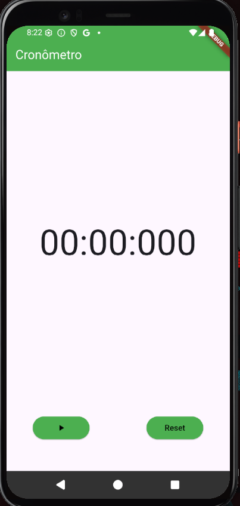
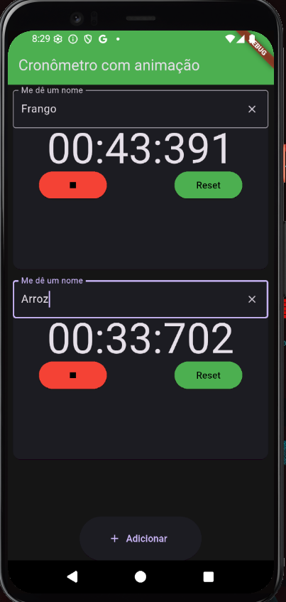
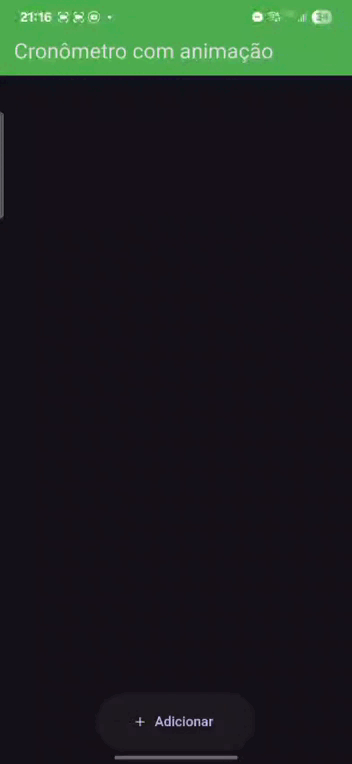
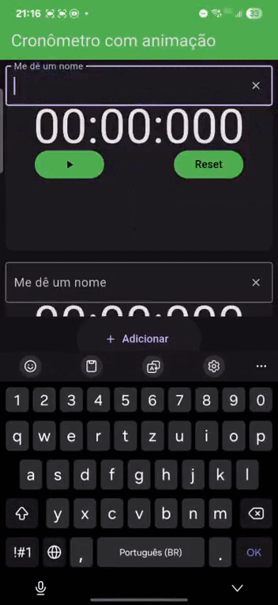
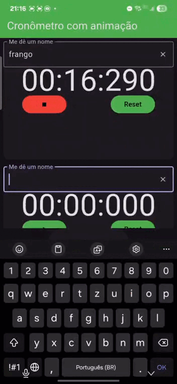
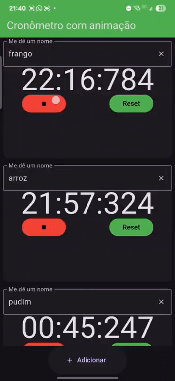

# Cronometro

Este projeto consiste em criar uma aplicativo mobile, que seja capaz de suportar multiplos cronômetros e temporizadores.

## Apresentação

  <strong>Inicialmente</strong> &nbsp;&nbsp;&nbsp;&nbsp;&nbsp;&nbsp;&nbsp;&nbsp;&nbsp;&nbsp;&nbsp;&nbsp;
  <strong>Agora</strong>  
  
 &nbsp;&nbsp;&nbsp;
  

## funções

- aplicativo possui a função de multriplos cronômetros
- É possível nomear cada cronômetro novo
- É possível Adicionar e excluir cada cronômetro

## Crie multiplos cronômetros

---

## Nomeie cada um

---

## Ideal para aquele dia corrido

## Renomeie, Pause, Reset ou Apague quando quiser

## em desenvolvimento

- BottomBar navigation
- Temporizadores com funções semelhantes aos dos cronômetros citados acima

## sobre mim

-Sou técnico de informática formado pela unicorp, e também sou técnico de eletroeletrônica formado pelo IFCE, sonho em trabalhar com programação, principalmente voltado para área de desenvolvimento mobile, IoT e robótica. Atualmente tenho 20 anos e trabalho como auxiliar de manuntenção de geradores, uma boa área, mas não a minha área, estou estudando para obter oportunidades no ramo da programação.